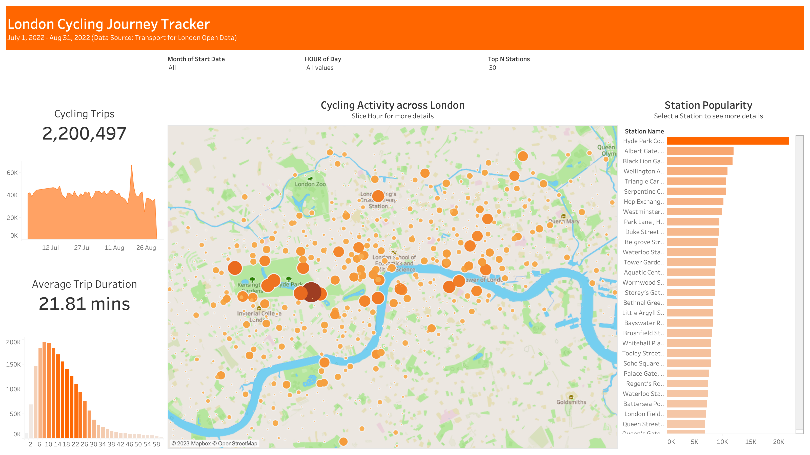

# London Cycling Analysis & Visualization
Using Python and Tableau

## Data Source
London cycling dataset is from [Transport for London](https://cycling.data.tfl.gov.uk/) open data, where it records cycling journey of biking sharing since 2016.

Journey data was collected from 2022 summer (July and Auguest). 

## Tableau Dashboard 

Dashboard presents analysis on: 
- Total number of cycling trips throughout London
- Average duration of trips
- Cycling activity, which is the number of trips starting from each station
- Station popularity, which is the top stations that have the largest number of starting trips

*Tableau workbook attached*

